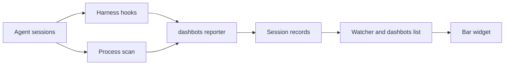

# Dashbots

Launching agent up on Omarchy is instant. That's great, but I end up with scattered agents sessions that get tricky to track. I like primitives that Grok Bots introduced (Dots is imitating it for good reason), but that application is best for focused work with long-lived, well-harnessed agents. 

> Dashbots is bot status at a glance. 

One icon per live session. Designed for Omarchy and its lovely theming.


## Install

From a checkout:

```sh
./bin/dashbots install
```

Install links `~/.local/bin/dashbots` to this script and refuses to overwrite a file that is already there. It writes the hook adapters, merges them into the harness hook files, copies the plugin into `~/.config/omarchy/plugins/dashbots/`, validates it, and places the bar slot to the right of weather if the slot is not already in the layout. If weather is not on the bar, the slot goes on the left, after the workspace switcher. A later install does not move a slot you have dragged. It enables the user systemd path unit `dashbots.path`, which starts `dashbots.service` while the flag exists. It also adds a Dashbots row to the Omarchy menu under Trigger, then Toggle.

Hooks load when a session starts. A session that is already open, including the one that ran install, will not report until it is restarted. Once the Grok, Claude, and Gemini adapters are installed, the process scan will not draw those harnesses either. Restart the session you want on the bar.

Remove it with `dashbots uninstall`. That drops the hooks, the plugin, the bar slot, the menu row, and the watcher. Session files already written are left in the state directory.


## How it works



Each agent session is one JSON record at `$XDG_STATE_HOME/dashbots/sessions/<id>.json` (when `XDG_STATE_HOME` is unset, `~/.local/state/dashbots/sessions/`). The fields are `id`, `harness`, `pid`, `cwd`, `title`, `status`, `window`, `updated_at`, `activity`, and `body`. `status` is `alive`, `working`, `waiting`, or `error`. Files are mode `0600` and replaced atomically. This tree is separate from `~/.local/state/omarchy/agents/`, which belongs to Omarchy's own usage meter.

`dashbots` is the reporter. Grok, Claude, and Gemini each get a hook adapter of the same weight. The adapter checks that the expected harness is actually an ancestor of the hook process, then writes the record. A hook that does not belong to that harness exits without writing. Hooks exit 0, print nothing on stdout, and never block a tool or a turn. The Gemini adapter is the exception on stdout: Gemini treats any other stdout as a system message, so that adapter prints `{}` after the reporter returns.

A process scan covers harnesses that have no adapter yet. But it may only write `alive`, plus the working directory and the terminal window. Codex, Antigravity (`agy`), and OpenCode are scan-only. Antigravity's hook file is not touched.

The bar widget watches the sessions directory and the toggle flag. A record is replaced atomically, and that change runs `dashbots list`. `list` prints a JSON array of records whose process is still alive, newest first. Dead pids stay on disk until `dashbots gc` drops them, and removing the file clears the mark. The watcher runs gc, and the scan, while Dashbots is on.

## What you see

The slot sits in the center of the bar, immediately to the right of the weather widget. While Dashbots is on, the slot is always there: one body per live session, or a single `_` when none are alive. Bodies, eyes, and tints are in the icon reference below.

Hover shows the harness, the session name (the directory it started in), and the current activity. A prompt's activity is the first line of that prompt. A tool's activity is the tool name. A permission prompt says `needs a decision`.

Left click focuses that session's terminal and switches to its workspace. The pointer stays where the click was. The address has to look like `0x` plus hex. That is the only Hyprland use. There is no menu on right click, and a click never starts a new agent.

`omarchy toggle dashbots` turns it off and on. The same switch is in the Omarchy menu under Trigger, then Toggle. A check mark on that row means it is on. The flag is `~/.local/state/omarchy/toggles/dashbots`. Present means on. Off exits the watcher. The widget hides, and the slot collapses, but the layout row stays where you dragged it. On again, it comes back. Default is on.

## Icon reference

Each mark is a white SVG. The bar mixes that white with a theme color, so the body is never a fixed hex. The eyes are holes punched out of the shape.

A new session gets one of the four bodies at random: circle, blob, triangle, or square. A shape already on the bar is not used again until every shape is taken. The pick stays with that session. The harness name is in the hover, not in the shape.

| Eyes | What it means |
| --- | --- |
| Two dots | Awake. Present, working, or waiting on you. |
| Two dashes | Asleep. This turn ended. |
| `_` | No session. Drawn in the muted color, not as a body. |

| Tint | When |
| --- | --- |
| Foreground, still | Alive. Present, and the activity is unknown. |
| Accent, breathing | Working. The body grows and shrinks. |
| Muted, still | Asleep. This turn ended. |
| Accent, still | Needs a decision. The dots stay open. |
| Urgent, still | The turn failed. The dots stay open. |

Foreground is the same ink as the clock. Accent is the theme highlight. Muted is the dim theme color. Urgent is the theme's alert color. A light theme uses those same roles. Working and a decision share the accent color. Working is the one that moves.

## Not (yet) implemented

A right-click note into the running agent is still open, and it is not in this version. Starting a new agent in that directory is the wrong outcome, so the click does not do it. The four bodies are not harness logos. There is no task-icon catalog and no overview window.

## License

MIT. See `LICENSE`.
