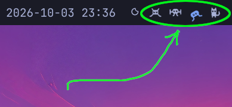
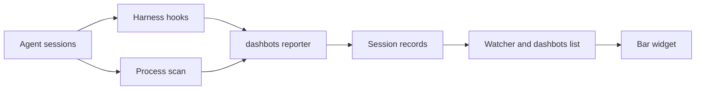

# Dashbots

You instantly launch agents in Omarchy. That's great, but you end up with scattered agent sessions that get tricky to track. I like ideas that Grok Bots introduced, but that application is best for focused work with long-lived, well-harnessed agents. 

*Dashbots is bot status at a glance.*

One icon per live session. Designed for Omarchy and its lovely theming.



**Lightweight**. Runs at about 14 MB and 0.3% of one core.

## Install

From a cloned repo:

```sh
./bin/dashbots install
```

Install links `~/.local/bin/dashbots` to this script. The bar config is `$XDG_CONFIG_HOME/dashbots/config` (when `XDG_CONFIG_HOME` is unset, `~/.config/dashbots/config`). Install writes that file. When the file is already there, install rewrites it from the current template and keeps values that are set: `swingMs`, `animate`, `place`, and `icons`. A value this version no longer accepts is left out. A key the file does not set takes the new default. Saving the file applies it. If the bar does not pick the save up, run `omarchy restart shell`.

Remove it with `dashbots uninstall`. That drops the hooks, the plugin, the bar slot, the menu row, the watcher, and the `~/.local/bin/dashbots` link. Session files already written are left in the state directory. The bar config is left too.


## What you see

While Dashbots is on, the widget slot is always there: one icon is added per live session, or a single `_` when none are alive—so you know that it's consuming (minimal!) system resources.

You can toggle off animation, change the swing speed, move the slot, and pick the icon set (`botvaders` or `primitives`, or a folder you add).

Hover shows the harness, the directory name, and the current activity. On Grok, Claude, and Gemini, a prompt's activity is the first line of that prompt, a tool's activity is the tool name, and a permission prompt says `needs a decision`. Antigravity shows `thinking` at the start of a turn and the tool name while a tool runs. `ask_question` and `ask_permission` say `needs a decision`.

Left click focuses that session's terminal and switches to its workspace.

`omarchy toggle dashbots` turns it off and on. The same switch is in the Omarchy menu under Trigger, then Toggle. A check mark on that row means it is on. The flag is `~/.local/state/omarchy/toggles/dashbots`.

## Icon reference

Each mark is a white SVG. The bar mixes that white with a theme color for all the colors a bot icon assumes.

A new session picks one icon at random from the set in the bar config. `icons botvaders` is the default. `icons primitives` is the other shipped set. An icon already on the bar is skipped until every icon in that set is in use. Saving a different set moves the marks that are already up onto it. Awake eyes are open holes with a small shine. Asleep eyes are dashes.

The set is the SVG files in `~/.config/omarchy/plugins/dashbots/icons/<name>/`. Add `{id}.svg` and a new session can use it. `{id}-asleep.svg` is the dash-eyed face; without that file the awake face stays up. A new folder there is another set: name it with `icons`. Install refreshes the shipped files and leaves files you added. Uninstall removes the plugin folder, added icons included.

| Eyes | What it means |
| --- | --- |
| Open | Present, working, waiting on you, or the turn failed. |
| Dashes | Asleep. This turn ended. |
| `_` | No session. Drawn in the muted color, not as a body. |

| Tint | When |
| --- | --- |
| Foreground, still | Alive. Present, and the activity is unknown. |
| Accent, swinging | Working. The body leans side to side and bobs. |
| Muted, still | Asleep. This turn ended. |
| Accent, still | Needs a decision. The eyes stay open. |
| Urgent, still | The turn failed. The eyes stay open. |

## How it works



Each agent session is one JSON record at `$XDG_STATE_HOME/dashbots/sessions/<id>.json` (when `XDG_STATE_HOME` is unset, `~/.local/state/dashbots/sessions/`). The fields include `id`, `harness`, `pid`, `cwd`, `title`, `status`, `window`, `created_at`, `updated_at`, `activity`, and `body`. `status` is `alive`, `working`, `waiting`, or `error`. `created_at` is the first write and stays put. Files are mode `0600` and replaced atomically. This tree is separate from `~/.local/state/omarchy/agents/`, which belongs to Omarchy's own usage meter.

`dashbots` is the reporter. Grok, Claude, Gemini, and Antigravity each get a hook adapter. The adapter checks that the expected harness is actually an ancestor of the hook process, then writes the record. A hook that does not belong to that harness exits without writing. Each adapter keeps one mark for a process. A new conversation replaces the previous mark on that process. A subagent does not get a mark. Hooks exit 0 and never block a tool or a turn. Grok and Claude print nothing on stdout. The Gemini adapter prints `{}`, because Gemini treats any other stdout as a system message. The Antigravity adapter prints `{"decision":"allow"}` on PreToolUse. An empty object is a deny on current agy, with no reason. On Stop it prints `{"decision":"allow"}` as well. That Stop value lets the turn end. Other events print `{}`.

A process scan covers harnesses that have no adapter yet. It may only write `alive`, plus the working directory and the terminal window. Codex and OpenCode are scan-only. Antigravity is the exception that still gets a scan mark: one still mark per `agy` process until a hook writes, and the scan does not change status after that. The hook file is `~/.gemini/config/hooks.json`. One named hook, `dashbots`, is merged into it. `~/.gemini/antigravity-cli/` is left alone. An Antigravity mark is one per process (`agy-<pid>`), and Stop does not remove it. Cancelling a turn writes that stop, so the mark leaves working. The mark goes away when the process exits.

The bar widget watches `~/.local/state/dashbots/sessions` with one `inotifywait`, and it watches the toggle flag. A record is replaced atomically. About 100 ms after the writes settle, that change runs `dashbots list`. `list` prints a JSON array of records whose process is still alive, newest session first. That order is when the session first appeared. Going idle, working, or waiting does not move the mark. A session that starts later is added at the front. Dead pids stay on disk until `dashbots gc` drops them, and removing the file clears the mark. The watcher runs gc, and the scan, while Dashbots is on.


## Not (yet?) implemented


Right-click a bot icon to send a message into that session.

Visually distinction for different harnesses, models, or providers.

A task-icon catalog.

An overview window (Hyprland. Off the Omarchy bar). 


## License

MIT. See `LICENSE`.
